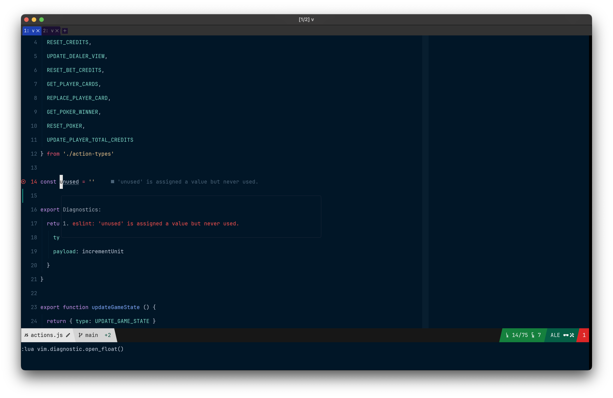

# Feline ALE Provider

A feline provider for displaying ALE diagnostics for the [feline.nvim plugin](https://github.com/famiu/feline.nvim).



## Requirements

+ [Feline.nvim](https://github.com/famiu/feline.nvim)
+ [ALE](https://github.com/dense-analysis/ale)
+ [NerdFonts](https://www.nerdfonts.com/) of your choice
+ [Neovim 0.5 and up](https://github.com/neovim/neovim/tree/v0.5.1)

## Installation

With packer.nvim, add it to the `requires` field in your feline setup:

```lua
use 'dense-analysis/ale'
use {
  'famiu/feline.nvim',
  -- tag = 'v0.3.0',
  requires = { 'creativenull/feline-ale-provider.nvim' },
}
```

With vim-plug:

```vim
Plug 'dense-analysis/ale'
Plug 'famiu/feline.nvim'
Plug 'creativenull/feline-ale-provider.nvim'
```

## Example

Take a look at an example file over at [`examples/feline.lua`](./examples/feline.lua)

## Documentation

Docs can also be found over at [`:help feline-ale-provider`](./doc/feline-ale-provider.txt).

### Setup

Import the ALE provider with the following and check the docs above:

```lua
local ale = require('feline.providers.ale')
```

## License

Covered by the [same GPL license](./LICENSE.md) provided in feline.
